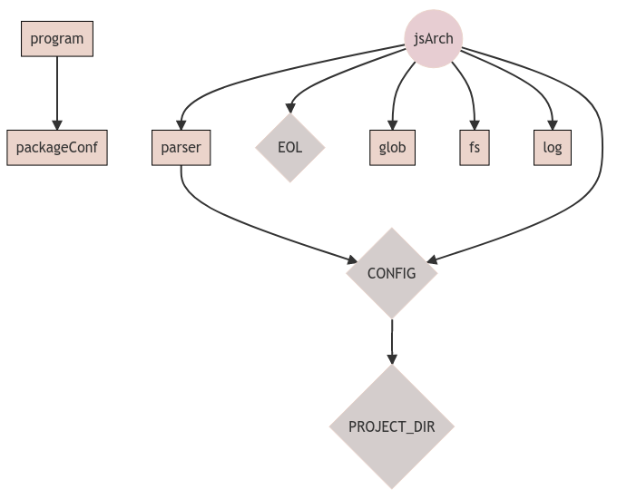

<!--
# This file is automatically generated by the `jsarch`
# module. Do not change it elsewhere, changes would
# be overriden.
-->
# Architecture Notes


## jsArch service

JSArch is basically a service that exposes a function allowing
 to extract and output architecture notes from the code.

This service needs some other services. To be able to mock and
 interchangethem, we use
 [Knifecycle](https://github.com/nfroidure/knifecycle) for its
 dependency injection and inversion of control feature.



[See in context](./src/jsarch.js#L43-L54)


### Extraction

We use AST parsing and visiting to retrieve well formed
architecture notes. It should be structured like that:
```js

/** Architecture Note #{order}: {title}

{body}
```

[See in context](./src/jsarch.js#L150-L160)


### Ordering

To order architecture notes in a meaningful way we
 use title hierarchy like we used too at school with
 argumentative texts ;).

A sample tree structure could be:
- 1
- 1.1
- 1.2
- 2
- 3

[See in context](./src/jsarch.js#L228-L241)


### Title level

By default, titles will be added like if the architecture
 notes were in a single separated file.

If you wish to add the architecture notes in a README.md file
 you will have to set the `titleLevel` option to as much `#`
 as necessar to fit the title hierarchy of you README file.

[See in context](./src/jsarch.js#L18-L26)


### Base

By default, links to the architecture notes right in the code
 are supposed relative to the README.md file like you would
 find it in the GitHub homepage of you projects.

To override it, use the `base` option.

[See in context](./src/jsarch.js#L30-L38)


## CLI

The JSArch CLI tool basically wraps the jsArch service
to make it usable from the CLI.

To see its options, run:
```
jsarch -h
```

[See in context](./bin/jsarch.js#L3-L12)

